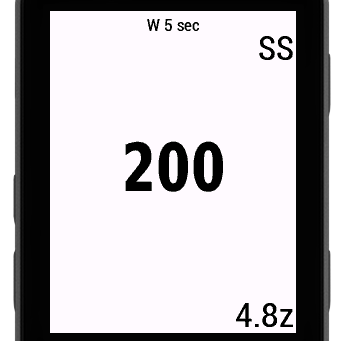
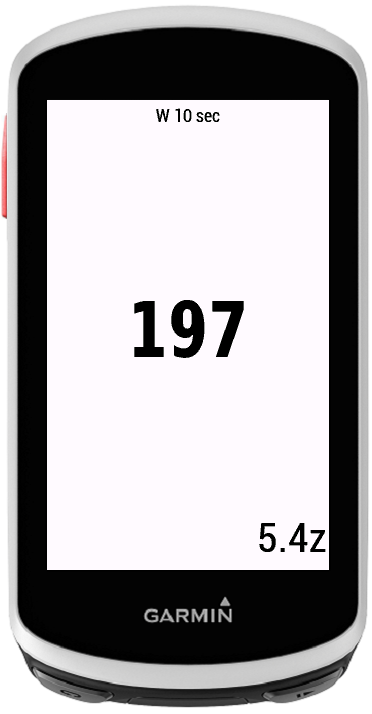
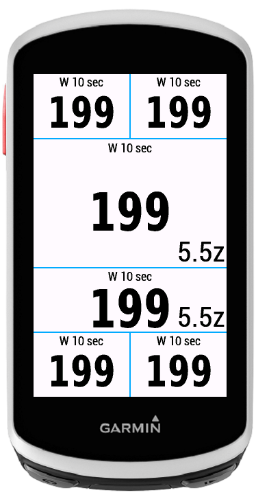
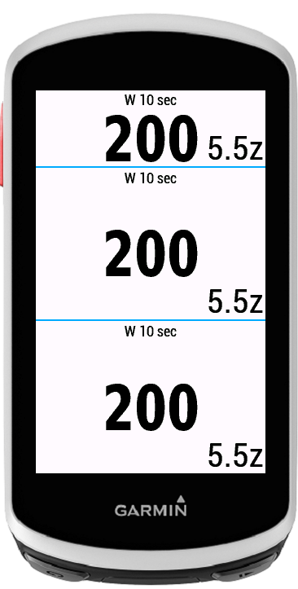
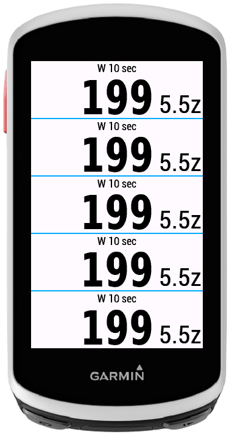

# Power With Zone

This Data Filed displays current average power and zone in one data field.
If data field is too small, then it only displays the current power without zone.
If you are on Sweet Spot zone then on right corner you have info about this. 

## What’s New

1.0.0 - Initial version

## Screenshots

